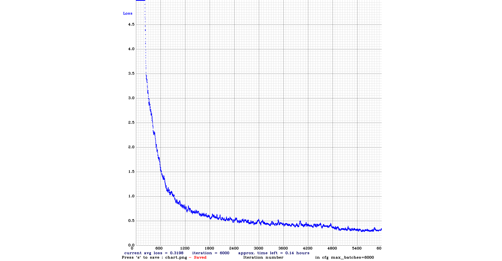
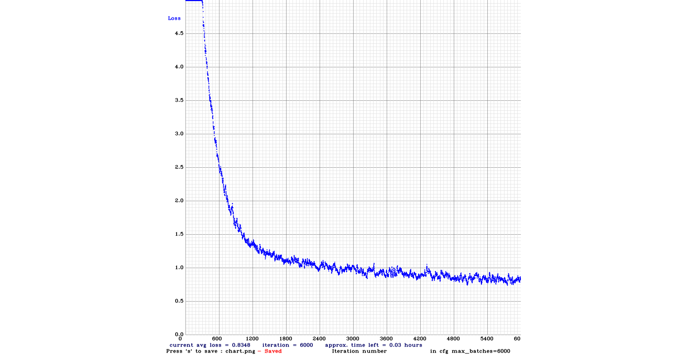
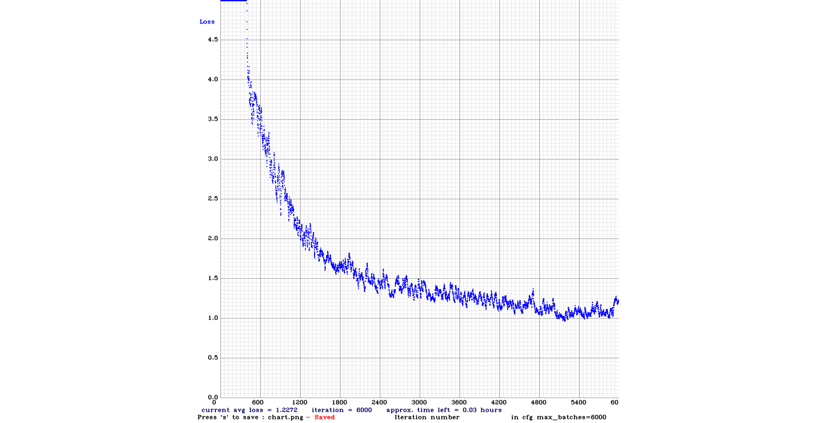
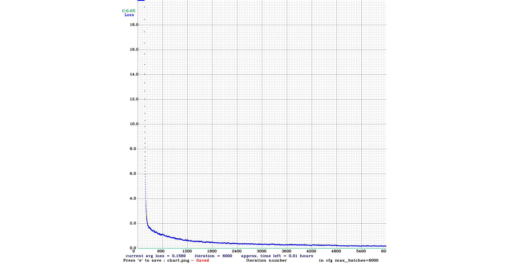

# Hand Approach Detection
This project aim to detect whether the hand is approaching. 
In this project, we use Florian Bruggisser et al. 's pre-trained model to analyze of the trend for hand approaching
[YOLO-Hand-Detection](https://github.com/cansik/yolo-hand-detection). 

This project can be run on the Windows10, Linux, and Raspbian OS.


### Training Dataset
- [CMU Hand DB](http://domedb.perception.cs.cmu.edu/handdb.html) 

- [Egohands](http://vision.soic.indiana.edu/projects/egohands/) 


### Referenced model

#### 1. YOLOv3



```
Precision: 0.89 Recall: 0.85 F1-Score: 0.87 IoU: 69.8
```

#### 2. YOLOv3-Tiny



```
Precision: 0.76 Recall: 0.69 F1-Score: 0.72 IoU: 53.67
```

#### 3. YOLOv3-Tiny-PRN
The tiny version of YOLO has been improved by the [partial residual networks paper](https://github.com/WongKinYiu/PartialResidualNetworks).



```
Precision: 0.89 Recall: 0.79 F1-Score: 0.83 IoU: 68.47
```

#### 4. YOLOv4-Tiny
With the recent version of YOLOv4 it was interesting to see how good it performs against it's predecessor. Same precision, but better recall and IoU.



```
Precision: 0.89 Recall: 0.89 F1-Score: 0.89 IoU: 91.48
```


### Inference the hands
The models have been trained on an image size `416x416`. It is also possible to inference it with a lower model size to increase the speed. A good performance on CPU has been discovered by using an image size of `256x256`.

The model itself is fully compatible with the opencv dnn module and just ready to use.

### Determine the trend of approaching
- First, we calculate the area of the bounding box of the hand

- Then determine whether it is increasing or decreasing in five consecutive frames, increasing means approaching, descending means away.

- Finally, the timestamp and trend of the moment are saved into the logging file

### Run 
Install numpy and opencv-python
```bash
pip3 install -r requirement
```

Download the configuration and weight of the models
```bash
# mac / linux
cd models && sh ./download-models.sh

# windows
cd models && .\download-models.ps1
```

Then run the following command to start a webcam detector with YOLOv3:

```bash
# with python 3
python approach_detection.py
```

Or this one to run a webcam detrector with YOLOv3 tiny:

```bash
# with python 3
python approach_detection.py -n tiny
```

For YOLOv3-Tiny-PRN use the following command:

```bash
# with python 3
python approach_detection.py -n prn
```

For YOLOv4-Tiny use the following command:

```bash
# with python 3
python approach_detection.py -n v4-tiny
```

